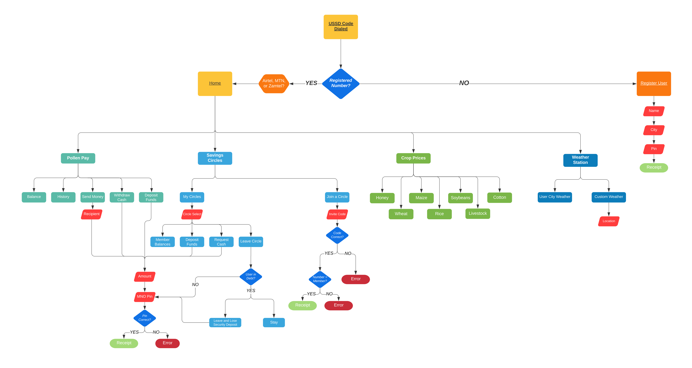
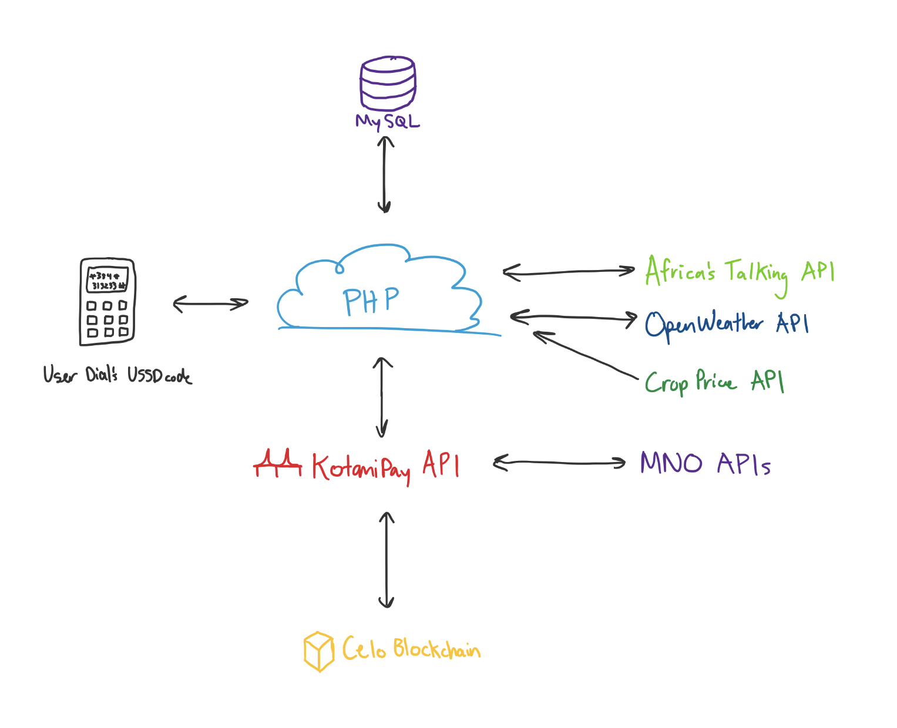

# USSD Savings Circles  🔵 🟢 🟡 🟠 🔴
# *(TL;DR) 🔑*
*[Pollen](https://www.fourthlinelimited.com/finance) is a platform for African farmers to access finanical 💸, crop 🌱, and weather services 🌦. Specifically, Pollen allows users to participate in digital savings circles (aka village banking), check the weekly forecast, and find local buyers for their crops. Pollen uses Unstructured Supplementary Service Data [(USSD)](https://en.wikipedia.org/wiki/Unstructured_Supplementary_Service_Data) to reach users without a smartphone or internet access and maximize prosperity. This is done with a PHP server and MySQL database. To manage user funds in a secure, transparent, and trustless manor, we use the [Celo Blockchain](https://www.celo.org). Mobile-money (i.e. [M-Pesa](https://en.wikipedia.org/wiki/M-Pesa)) serves as the on- and off-ramps to cUSD, a stablecoin on Celo that is pegged to the US Dollar. This architecture can be expanded beyond savings circles to include interest-barring savings, lotteries, round-up savings, crypto investing, and much more 🚀* 

## Overview 📚
#### USSD Flow Process Diagram

#### Tech-Stack Diagram

#### Celo
* High level overview and capability, value adds, competitive advantage

## APIs 🌐
#### Africa's Talking
USSD is powerful and prevalent, especially in Africa. By using the [Africa's Talking](https://www.africastalking.com) API, we can easily communicate with our users via USSD and other mobile avenues, such as calling, SMS, and mobile money. We talk with our Africa's Talking API through a webhook URL, which is our PHP server. Responses followed by user inputs start with CON while responses that end sessions start with END. 

#### OpenWeather
In order to query the weekly forecast for any city in Zambia (or the world) we use the [OpenWeather](https://www.openweathermap.org) API. Their freshly updated [one-call API](https://openweathermap.org/api/one-call-api) allows us to query a weekly forecast with a single URL 

#### KotaniPay (WIP)
For communicating with the Celo Blockchain, we use the KotaniPay USSD to Celo gateway API from [KotaniLabs](https://www.linkedin.com/company/kotanilabs/?originalSubdomain=ke). This is in closed beta and not included in the code.

#### Crop Prices (WIP)
For this step you can pull data from many different sources. We partnered with a local government agency in Zambia and use their API.

## Server and Database
#### 000Webhost
#### MySQL / PHP MyAdmin

## Database Design 🛠
#### users Table
Name | Type | Length | Default
-----|------|--------|--------
username | VARCHAR | 20 | NULL
publickey | VARCHAR | 30 | NULL
phonenumber | VARCHAR | 20 | NULL
location | VARCHAR | 20 | NULL
location | VARCHAR | 5 | NULL

#### session_levels Table
Name | Type | Length | Default
-----|------|--------|--------
session_id | VARCHAR | 50 | NULL
phonenumber | VARCHAR | 20 | NULL
date | DATE | n/a | CURRENT TIMESTAMP
level | tinyint | 1 | NULL
circleSelect | VARCHAR | 20 | NULL

#### circles Table
Name | Type | Length | Default
-----|------|--------|--------
circleID | VARCHAR | 20 | NULL
circleName | VARCHAR | 20 | NULL
balance | VARCHAR | 6 | NULL
quorem | VARCHAR | 3 | NULL
threshold | VARCHAR | 3 | NULL

#### circleInvites Table
Name | Type | Length | Default
-----|------|--------|--------
circleID | VARCHAR | 20 | NULL
inviter | VARCHAR | 20 | NULL
invitee | VARCHAR | 20 | NULL
date | DATE | n/a | CURRENT TIMESTAMP

#### circleMembers Table
Name | Type | Length | Default
-----|------|--------|--------
circleID | VARCHAR | 20 | NULL
phonenumber | VARCHAR | 20 | NULL
circleIndex | tinyint | 1 | NULL

#### circleProposals Table
Name | Type | Length | Default
-----|------|--------|--------
circleID | VARCHAR | 20 | NULL
txnhash | VARCHAR | 30 | NULL
phonenumber | VARCHAR | 20 | NULL
action | VARCHAR | 20 | NULL
value | VARCHAR | 20 | NULL
* Action (e.g. add members, request funds, set interest rates, etc)
* Value (e.g. phone #, amount of funds, rate, etc)

#### circleVotes Table
Name | Type | Length | Default
-----|------|--------|--------
circleID | VARCHAR | 20 | NULL
txnhash | VARCHAR | 30 | NULL
phonenumber | VARCHAR | 20 | NULL
vote | VARCHAR | 3 | NULL
yescount | VARCHAR | 3 | NULL

#### circleDeposits Table
Name | Type | Length | Default
-----|------|--------|--------
circleID | VARCHAR | 20 | NULL
txnhash | VARCHAR | 30 | NULL
phonenumber | VARCHAR | 20 | NULL
amount | VARCHAR | 20 | NULL
date | DATE | n/a | CURRENT TIMESTAMP

#### circleWithdrawals Table
Name | Type | Length | Default
-----|------|--------|--------
circleID | VARCHAR | 20 | NULL
txnhash | VARCHAR | 30 | NULL
votetxnhash | VARCHAR | 30 | NULL
phonenumber | VARCHAR | 20 | NULL
amount | VARCHAR | 20 | NULL
date | DATE | n/a | CURRENT TIMESTAMP

#### coordinates Table
Name | Type | Length | Default
-----|------|--------|--------
cityname | VARCHAR | 20 | NULL
lat | VARCHAR | 10 | NULL
lon | VARCHAR | 10 | NULL

## Code Walk Through 🚶🏽‍♀️
#### User Registration
#### Tracking User Session with Levels
#### OpenWeather API

#### Requerying data
* storing user actions (circle select)
* checking user level
* pulling circle name
* Should this all be done at the very beginning? Query all data ahead of time, then just requery with Available[]?
#### Generalizability
* database design
* strtolower
* ucfirst

## Resources 😅
#### Africa's Talking Examples
#### PHP Help
#### MySQL Help
